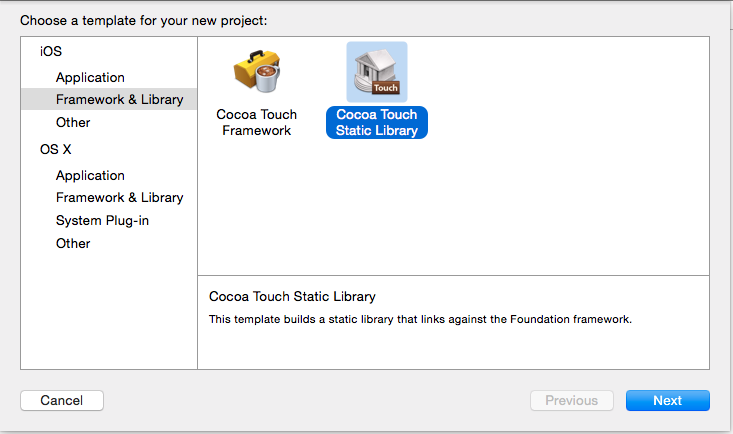
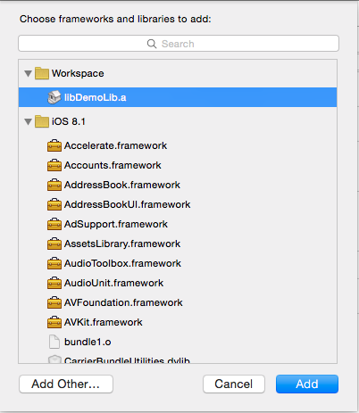
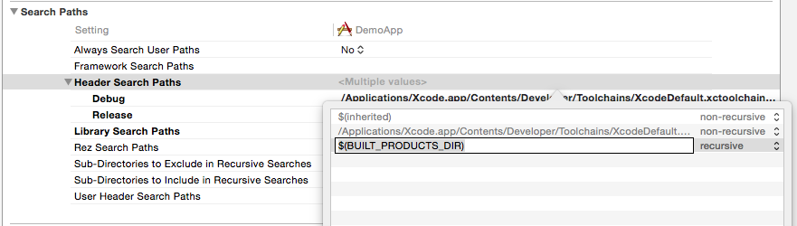
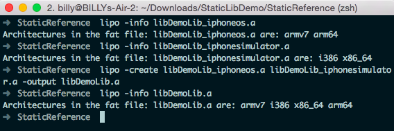

静态库的使用
---

### 建立静态库
新建 Project 的时候选择 `Framework & Library -> Cocoa Touch Static Library` 即可

### 直接引用静态库
1. 新建一个 Workspace ，将需要使用静态库的App项目文件和静态库Lib项目文件都拖进去  
	
	
2. 在App的 `Build Phases -> Link Binary With Libraries` 中添加静态库的 ` .a` 文件  
	

3. 在App的 `Build Settings -> Search Paths -> Header Search Paths` 中添加路径 `$(BUILT_PRODUCTS_DIR)` 并设置为 `recursive`  
	

4. 这时即可在App项目中使用静态库内的函数方法


### 引用编译好的静态库
1. 静态库项目文件 `Product -> Scheme -> Edit Scheme`，把 `Build Configuration` 改成 `Release`
2. 使用模拟器和真机分别编译一次，对生成的 `.a` 文件 `右键 -> Show in Finder`具体路径在:

	```
	/Users/用户名/Library/Developer/Xcode/DerivedData/项目名/Build/Products/
	```

3. 在 `Release-iphoneos` 和 `Release-iphonesimulator` 中有两个 `.a`文件，使用命令

	```
	lipo -info *.a
	```
	可以发现两者的使用的架构是不一样的，分别对应着真机和模拟器的环境

4. 可以在不同条件下使用不同的 `.a` 文件，也可以使用命令

	```
	lipo -create /pathA/iphone.a /pathB/simulator.a -output /pathC/universal.a
	```
	生成一个公用的 `.a` 文件
	
	
	
5. 把 `.a` 文件和头文件拖入项目中即可使用
